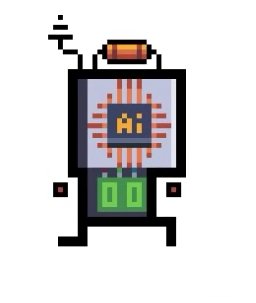
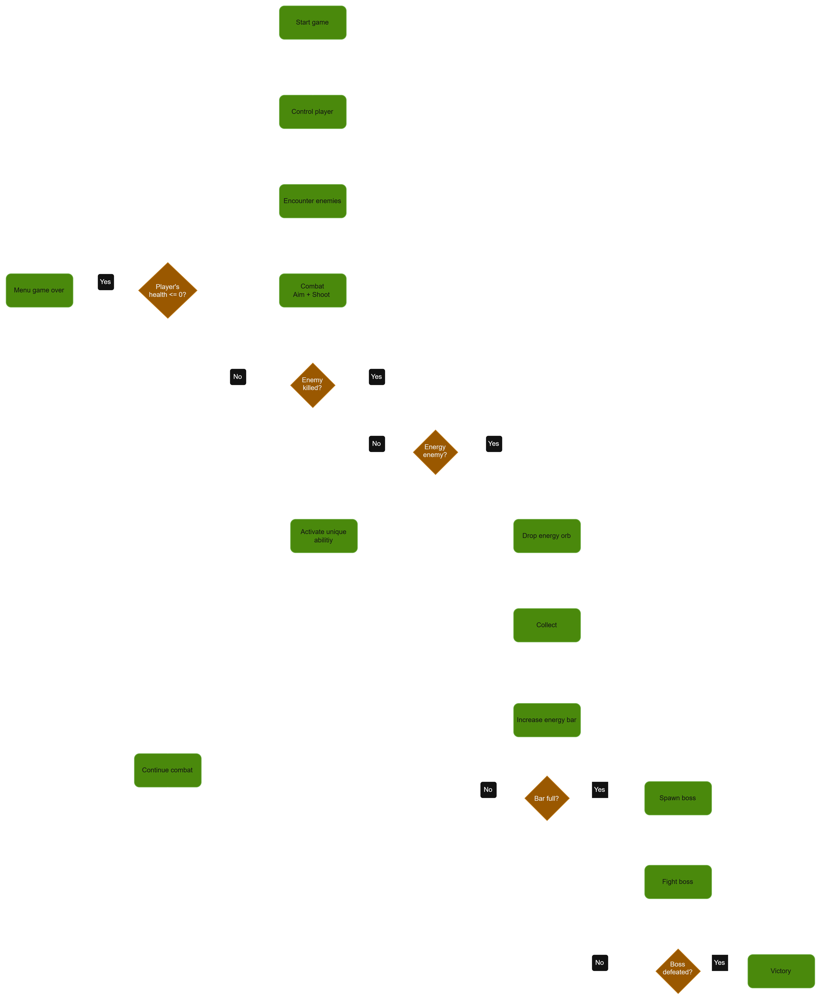
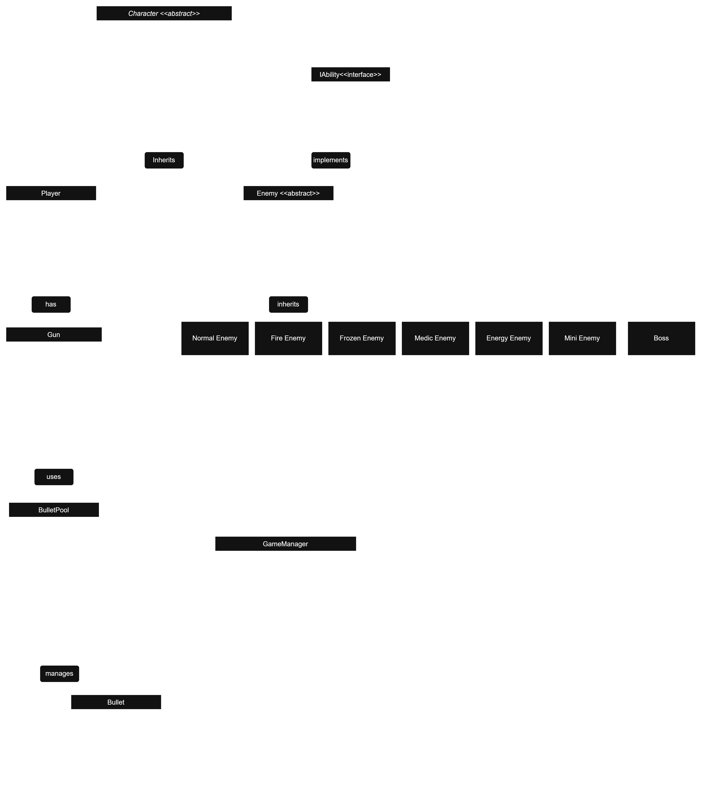

# 🎮 2D Top-Down Shooter

A 2D top-down shooter developed with **Unity and C#**.

## 🛠️ Technologies

Unity, C#, OOP, Object Pooling, Singleton Pattern, State Machine, Coroutines, Interface.

## 🏗️ Architecture

📊 View Game Flow Diagram

 

📐 View Class Diagram (Initial Version)

 

