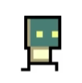
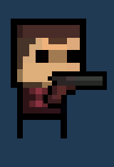

# 🎮 2D Top-Down Shooter

A 2D top-down shooter developed with **Unity and C#**.

## 🎥 Gameplay Demo

[▶️ Watch Gameplay Demo](https://youtu.be/6_Sq2cUDy1E)

📸 View Gameplay Screenshots

 

## 🛠️ Technologies

- Unity
- C#
- Object-Oriented Programming (OOP)
- Object Pooling
- Singleton Pattern
- Observer Pattern
- State Machine
- Coroutines
- Interfaces

## 🏗️ Architecture

📊 View Game Flow Diagram

 

📐 View Class Diagram (Initial Version)

 

